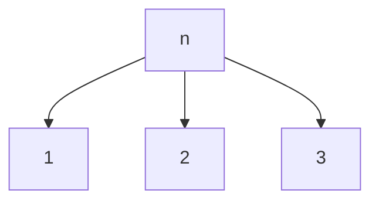
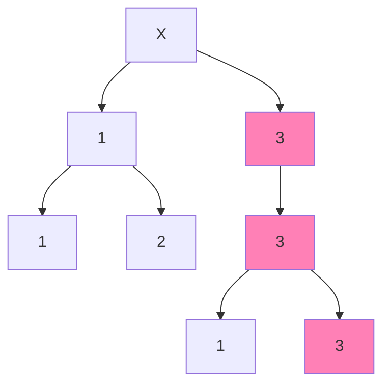

---
tags:
  - Tree
aliases:
  - Prefix Tree
---
A _Trie_ is a **specialised tree** data structure used for **storing** and **retrieving strings** from a dictionary/set.

> [!question]
> The word _trie_ comes from re`trie`val.

Unlike a [[Binary Search Tree]], a _Trie_ **does not** store a key, instead it uses the position in the _trie_ to determine the associated key.

![[Trie Image.png]]

---
### Searching
Each _trie_ node has an **array of length** $R$ with a position for every possible value in the set you are looking for (e.g. The letters of the alphabet). Hence, searching is as easy as check if a given position is null or not.

#### Example
This _trie_ has an alphabet of $A, B, C$ corresponding to positions $1,2,3$ in each _trie_'s array.

Hence a given node $n$ would look like:

And $333$ is a valid string in this graph, but not $323$:

